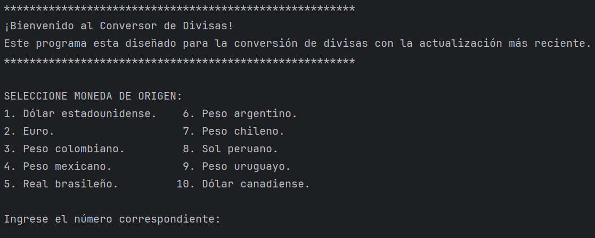
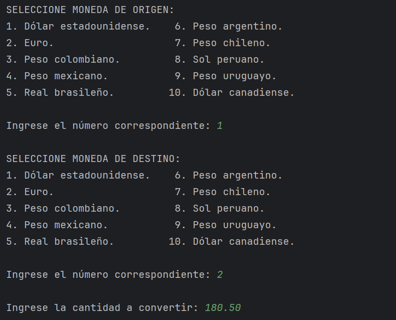
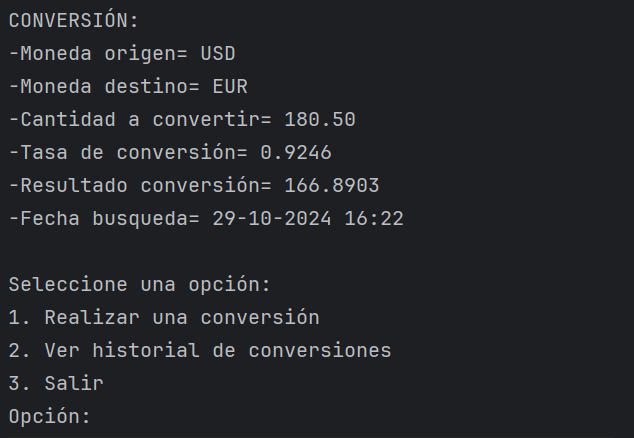
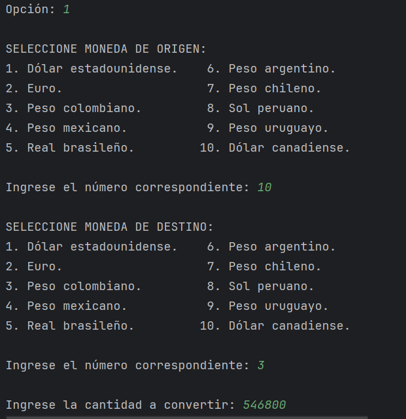
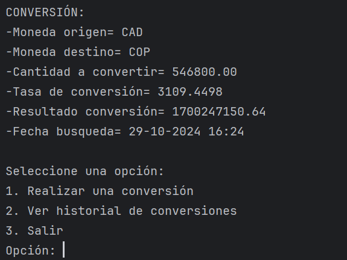
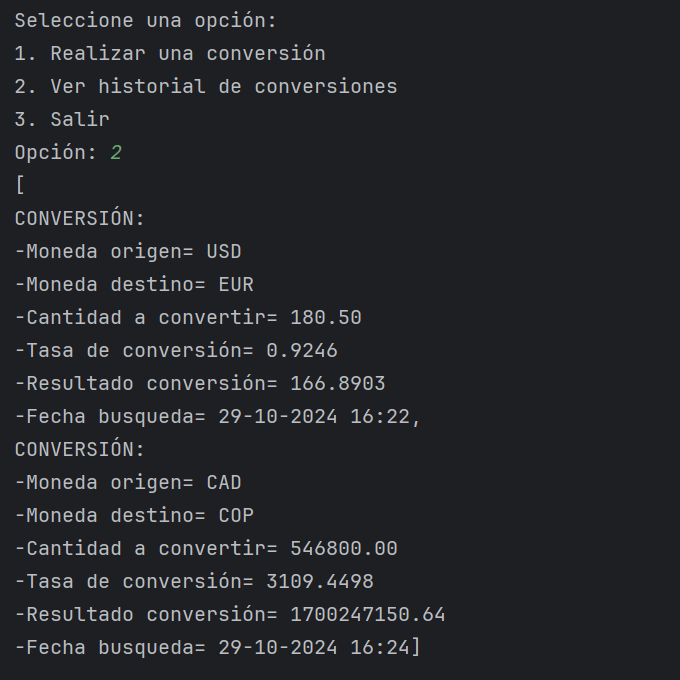
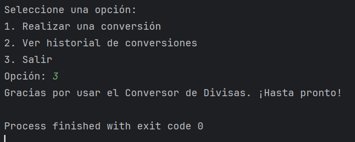

# 💱 Conversor de Divisas con Java 💸

> 🧑‍💻 **Proyecto desarrollado en Java para realizar conversiones de divisas en tiempo real, usando una API externa y almacenando el historial de conversiones.**

---

## 📖 Descripción

Este proyecto permite al usuario convertir entre diferentes divisas usando tasas de cambio obtenidas en tiempo real desde una **API** externa. Al realizar una conversión, 
los resultados se muestran en consola y se almacenan en un archivo de historial con la fecha y la hora exacta de cada operación.

---

## ⚙️ Funcionalidades

- **Conversiones entre múltiples divisas** (incluye las principales monedas y varias de Latinoamérica).
- **Interfaz de menú** en consola para seleccionar divisa de origen, divisa destino y monto.
- **Almacenamiento del historial** de conversiones en un archivo `.txt` con fecha y hora de cada operación.
- **Reintentos automáticos** y manejo de excepciones para entradas incorrectas y divisiones inexactas.
  
---

## 🚀 Instalación y Uso

### 1. Clonar el repositorio
bash
git clone https://github.com/JGarcia-C/challenge-conversor-monedas.git
cd challenge-conversor-monedas
### 2. Requerimientos
Java 8 o superior.
IDE: Se recomienda IntelliJ IDEA o Eclipse.
### 3. Configuración
Asegúrate de tener instalada la librería Gson para procesar JSON.
Configura el archivo .properties con la URL de la API de tasas de cambio.
### 4. Ejecución
Compila y ejecuta el proyecto desde tu IDE o mediante terminal:
javac -cp .:gson.jar ConversorMain.java
java -cp .:gson.jar ConversorMain
Sigue el menú interactivo en consola para realizar tus conversiones.

---

## 📋 Ejemplo de Uso y Salida

### Inicio del Programa:

### Realizar una conversión: Una vez seleccionadas las divisas y el monto, el programa muestra el resultado y pregunta si deseas realizar otra conversión o ver el historial.

### -Seleccion:

### -Respuesta:

### -Seleccion 2:

### -Respuesta:

## Historial: Se guarda las respuestas en una lista, una vez el usuario escoge la opcion evidencia en consola.

## Finalizacion app: Salida de aplicativo.

---

## 🛠️ Tecnologías Usadas
- **Java - Para la lógica principal.
- **Gson - Para manejar JSON en la respuesta de la API.

---

## 👤 Autor
Usuario GitHub: JGarcia-C

---

## 🤝 Contribuciones
Las contribuciones son bienvenidas. Si deseas mejorar este proyecto, por favor abre un issue o envía un pull request.

---

### ¡Gracias por usar este conversor de divisas! 🚀💱
